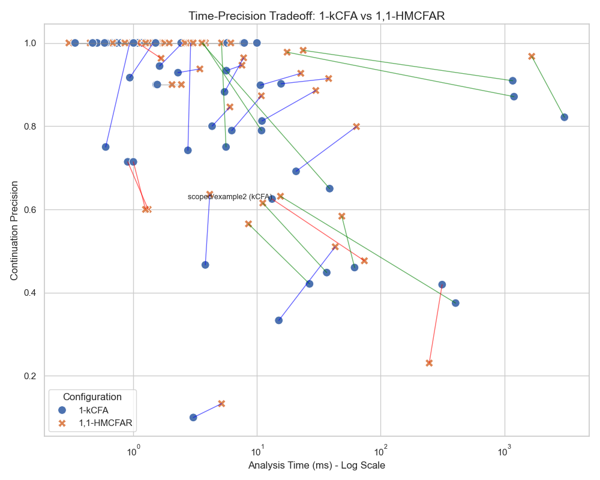

# Evaluation {#evaluation}

We evaluate our analysis along two dimensions: precision and scalability.
Specifically, we structure our evaluation to answer three key questions:
1.  **High-Level Efficacy:** Does our approach solve complex benchmarks that standard baselines cannot?
2.  **Trade-off Analysis:** How does our branched history approach (HMCFA) compare to traditional linear history (k-CFA) in terms of cost and precision?
3.  **Parameter Sensitivity:** How do the call ($m$) and handler ($h$) sensitivity parameters impact analysis performance?

## 1. High-Level Efficacy

To assess the practical value of our approach, we compare our $(h,m)$-CFA with Rebinding (HMCFAR) against a flow-insensitive baseline (0-CFA) and context-sensitive baselines (1-kCFA, 2-kCFA).
We focus our comparison on "complex" benchmarks where the 0-CFA baseline fails to achieve perfect precision (< 99%), filtering out trivial cases.

Figure 1 shows the **geometric mean** precision (both Continuation and Value) for these complex benchmarks, with error bars indicating geometric standard deviation (GSD). We also report the **median** in parentheses for completeness.
*   **0-CFA** achieves a geomean continuation precision of **55%** (median **69%**).
*   **1-kCFA** improves this to **72%** (median **85%**).
*   **2-kCFA** further improves to **78%** (median **94%**).
*   **1,1-HMCFAR** (using $h=1, m=1$) achieves **82%** (median **96%**), outperforming 2-kCFA.
*   **1,2-HMCFAR** (using $h=1, m=2$) achieves **84%** (median **100%**).

Notably, **1,0-HMCFAR** ($m=0$) achieves **66%** geomean (median **83%**). This shows that handler context alone ($h=1$) provides a baseline improvement over 0-CFA, but combining it with call sensitivity ($m \ge 1$) unlocks superior precision.

**Value Precision:** In terms of value precision, 1,2-HMCFAR achieves a geomean of **88%** and a median of **94%**, significantly outperforming baselines (0-CFA median **80%**) and matching or beating 2-kCFA (median **87%**). This confirms that HMCFAR's precise control flow analysis translates to high value flow precision.

## 2. Expert Trade-off Analysis: Linear vs. Branched History

For analysis experts, we compare k-CFA (linear history) and HMCFAR (branched history) across two dimensions: State Space and Analysis Time.

### Cost-Precision Trade-off (States)

Figure 2 illustrates the trade-off between state space size and precision. Detailed cost/benefit analysis is encoded in the colors:
*   **Green lines (Win-Win):** HMCFAR improves precision **AND** reduces state space.
*   **Blue lines (Trade-off):** HMCFAR improves precision but explores more states.
*   **Red lines (Regression):** HMCFAR has worse precision.

We see that for many benchmarks, HMCFAR achieves higher precision (Green/Blue lines). In cases like `complex-layers` (Blue), this precision comes at a moderate increase in state space size.

### Time-Precision Trade-off (Time)

Figure 3 shows the trade-off in terms of analysis time.
*   **Green lines (Win-Win):** HMCFAR improves precision **AND** reduces analysis time.
*   **Blue lines (Trade-off):** HMCFAR improves precision but takes longer.
*   **Red lines (Regression):** HMCFAR has worse precision.

This view confirms that HMCFAR often pays a time cost for its precision (Blue lines), but in some cases (Green lines), the precision trade-off yields performance benefits due to smaller state spaces or faster convergence.

This view confirms that HMCFAR often pays a time cost for its precision (green lines often show increased time), but in some cases (blue lines), the precision trade-off yields performance benefits.

Finally, we explore the design space of our HMCFAR analysis by varying the call sensitivity ($m$) while fixing handler sensitivity ($h$).

Figure 4 presents the median precision as we increase $m$.
*   **Impact of $m$:** Increasing call sensitivity ($m$) provides substantial gains up to $m=1$, resolving many ambiguities.
*   **Diminishing Returns:** Beyond $m=1$, precision plateaus for most benchmarks.
*   **Role of $h$:** Comparing the lines for $h=0, 1, 2$, we see that having at least $h=1$ provides a consistent improvement over $h=0$, but $h=2$ adds little value. This confirms that $(1,1)$ is the optimal trade-off.

## Threats to Validity

*   **Benchmark Selection:** Our "complex" filter may bias results, but it focuses the evaluation on the cases where analysis choice actually matters.
*   **Baseline Tuning:** We compare against 1-kCFA. Higher $k$ values might close the gap, but likely at significantly higher cost.

