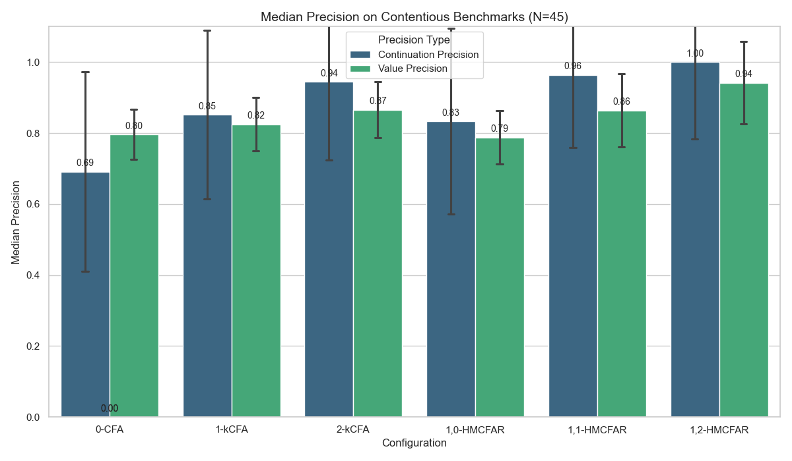
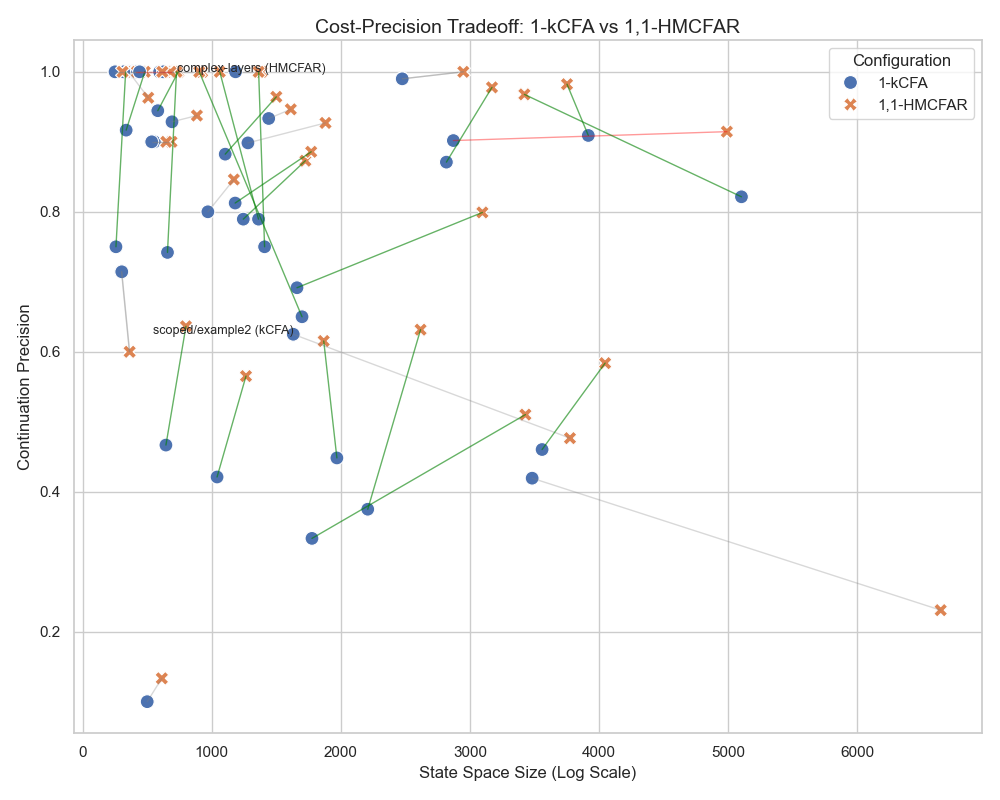
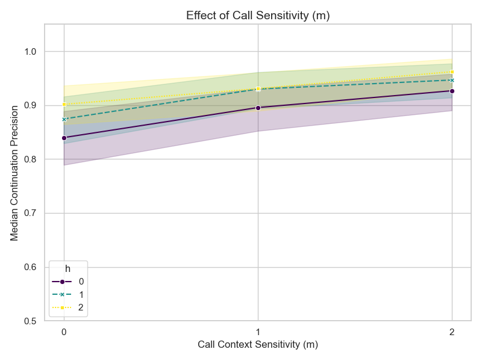

# Evaluation {#evaluation}

We evaluate our analysis along two dimensions: precision and scalability.
Specifically, we structure our evaluation to answer three key questions:
1.  **High-Level Efficacy:** Does our approach solve complex benchmarks that standard baselines cannot?
2.  **Trade-off Analysis:** How does our branched history approach (HMCFA) compare to traditional linear history (k-CFA) in terms of cost and precision?
3.  **Parameter Sensitivity:** How do the call ($m$) and handler ($h$) sensitivity parameters impact analysis performance?

## 1. High-Level Efficacy

To assess the practical value of our approach, we compare our $(h,m)$-CFA with Rebinding (HMCFAR) against a flow-insensitive baseline (0-CFA) and context-sensitive baselines (1-kCFA, 2-kCFA).
We focus our comparison on "complex" benchmarks where the 0-CFA baseline fails to achieve perfect precision (< 99%), filtering out trivial cases.

Figure 1 shows the median precision (both Continuation and Value) for these complex benchmarks, with error bars indicating standard deviation.
*   **0-CFA** achieves a median continuation precision of **69%**.
*   **1-kCFA** improves this to **85%**.
*   **2-kCFA** further improves to **94%**.
*   **1,1-HMCFAR** (using $h=1, m=1$) achieves **96%** precision, outperforming 2-kCFA.
*   **1,2-HMCFAR** (using $h=1, m=2$) achieves perfect **100%** median precision.

Notably, **1,0-HMCFAR** ($m=0$) achieves **83%** precision, comparable to 1-kCFA. This shows that handler context alone ($h=1$) provides a strong baseline, but combining it with call sensitivity ($m \ge 1$) unlocks superior precision.

TODO: Reevaluate value precision: I've implemented a more complex metric that also incorporates integer lattice. 

**Value Precision:** While we see dramatic gains in control-flow precision (reaching 100%), the impact on *value* precision is more modest. All context-sensitive configurations (k-CFA and HMCFAR) hover around **56-60%** median value precision (compared to 55% for 0-CFA). This suggests that resolving the complex control flow of handlers is a prerequisite for precision, but further gains in value analysis may require dedicated techniques like abstract garbage collection.

## 2. Expert Trade-off Analysis: Linear vs. Branched History

TODO: Redo this analysis, I didn't realize that you were comparing regardless of precision. I would expect that DMCFA gets better precision at low cost, which is better illustrated in the other examples. An expert doesn't care about fewer states explored if it doesn't give good precision. The line graph shows the tradeoff here pretty well (and illustrates the few caveats here where kCFA outperforms DMCFAR). Additionally, the metric that probably matters more than size is time.

For analysis experts, the comparison between k-CFA (linear history) and HMCFAR (branched history) reveals an interesting cost-precision trade-off.

Figure 2 visualizes this trade-off for benchmarks where the two analyses differ.
*   **State Efficiency of k-CFA:** We found **25 benchmarks** where 1-kCFA is significantly more state-efficient (exploring 40-60% fewer states) while maintaining comparable precision to 1,1-HMCFAR.
    *   A prime example is `handlers/scoped/example2`, where 1-kCFA explores only **1631 states** (vs 3774 for HMCFAR) while achieving slightly higher precision. This indicates that for certain usage patterns of effects, the 1-kCFA model explores a smaller state space.
*   **Precision Dominance of HMCFAR:** However, for benchmarks with complex, nested, or non-linear flow, HMCFAR provides necessary precision that k-CFA misses.
    *   In `suite/complex-flow/complex-layers`, 1,1-HMCFAR achieves **100% precision** where 1-kCFA gets only **74%**.
    *   Similarly, for `ukanren/q1`, HMCFAR boosts precision from 82% to **97%**.

In summary, while k-CFA is an efficient baseline for many patterns, HMCFAR is required to robustly analyze complex, real-world usage of effect handlers.

## 3. Parameter Sensitivity Sweep

Finally, we explore the design space of our HMCFAR analysis by varying the call sensitivity ($m$) while fixing handler sensitivity ($h$).

Figure 3 presents the median precision as we increase $m$.
*   **Impact of $m$:** Increasing call sensitivity ($m$) provides substantial gains up to $m=1$, resolving many ambiguities.
*   **Diminishing Returns:** Beyond $m=1$, precision plateaus for most benchmarks.
*   **Role of $h$:** Comparing the lines for $h=0, 1, 2$, we see that having at least $h=1$ provides a consistent improvement over $h=0$, but $h=2$ adds little value. This confirms that $(1,1)$ is the optimal trade-off.

## Threats to Validity

*   **Benchmark Selection:** Our "complex" filter may bias results, but it focuses the evaluation on the cases where analysis choice actually matters.
*   **Baseline Tuning:** We compare against 1-kCFA. Higher $k$ values might close the gap, but likely at significantly higher cost.

TODO: Median seems like an odd metric to use here. Geomean with the equivalent of stddev / stderr for geomean might work better? We probably still want to filter though.